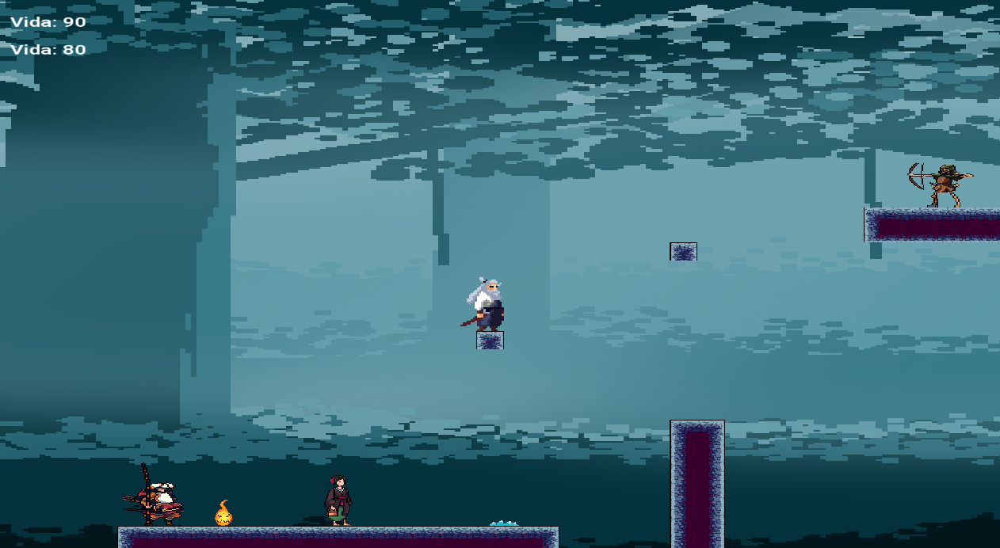

# SHADOW BLADE
   A 2D platformer game developed in C++ using SFML Graphics Library. Defeat skeletons, samurais and archers to advance through levels! <br>

    <br>

## 🕹️ Features 
   • **Singleplayer & Multiplayer** : You can play singleplayer with a samurai or with a friend in cooperative mode (adding a warrior gueisha!) <br>
   • **Two levels** : You can choose to play in two levels : Pantanal or Nether, but you can play them consecutively! <br>
   • **Menus**: Main Menu, Leaderboard, Pause Menu, menu to choose levels and Game-saving functionality. <br>
   • **Enemies and Obstacles** : 3  enemies and 4 obstacles, each one having their own behavior. <br>

    <br>
## 🚀 Installation & Running
   ### Prerequisites
   • C++ compiler (GCC, Clang or MSVC) <br>
   • Makefile <br>
   • SFML library <br>
   ### Building the Game
   1. Clone the repository 
      ```sh
         https://github.com/FernandoFrareVieira/TecProg.git
         cd TecProg
      ```
   2. Build using Makefile
         ```sh
            make
         ```
   3. Run the Game
         ```sh
            ./main
         ```
   ## ⚙️ Tested Configurations  
   • OS : Linux Ubuntu    
   • Compiler : g++ (Ubuntu 13.3.0-6ubuntu2~24.04) 13.3.0  
   • Graphic Library : SFML 2.6.1

   
    <br>

## 🎯 Development Overview
   This project was fully implemented using Object-Oriented Programming (OOP) principles, besides utilizing UML (Unified Modeling Language) diagrams to guide architecture and implementation.
   ### 🧠 Desing Patterns Used 
   ✅ Singleton - Ensures a single instance for managers like graphics, input and state handling. <br>
   ✅ Iterator - Efficient entity traversal. <br>
   ✅ Observer - Input management and UI updates.<br>
   ✅ State - Managing game states (levels and menus). <br>
## 📜 Credits 
   ### :technologist: Developers 
   • Felipe dos Reis Garcez <br>
   • Fernando Frare Vieira
   ### Sprite Credits 
   Main player:https://xzany.itch.io/samurai-2d-pixel-art  
   Samurai : https://craftpix.net/freebies/free-samurai-pixel-art-sprite-sheets/?srsltid=AfmBOooFHXlZegE1snQaE7NmrrbryMp7Ga1uumN4GoyUioO3LGWzsOYY  
   Ninja : https://craftpix.net/freebies/free-ninja-sprite-sheets-pixel-art/?srsltid=AfmBOorGOsljvE7rUzstf4PwUKbwJh88DChnSk7Ht1q7IB-33w3Epwz4  
   Skeleton : https://craftpix.net/freebies/free-skeleton-pixel-art-sprite-sheets/?srsltid=AfmBOortB9GLsHUYweM1g7aLlcjO5YMQQK9sFGYKGD67Q6Dgwib3hjpL    
   
   
